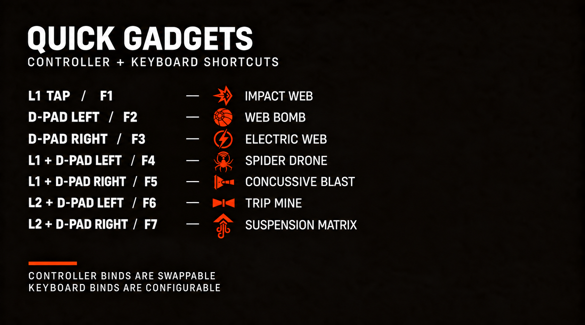

# Quick Gadgets

Quick Gadgets adds fast, Spider-Man 2-inspired gadget shortcuts to **Marvel's Spider-Man Remastered**. A shortcut selects and fires its assigned gadget, allows repeat shots for a short window, and then returns to Web Shooter.

Created by **Sticky Sushi**.



## Compatibility

- Steam version of Marvel's Spider-Man Remastered, executable version **4.0630.0.0**
- Keyboard and mouse supported
- Controller support requires XInput
  - Xbox controllers work directly
  - For PlayStation and other non-XInput controllers, try Steam Input first
  - If the shortcuts do not respond through Steam Input, disable it for the game and use DS4Windows in Xbox 360 emulation mode
- Controller users must set the in-game **Gadget Select Button** to **Hold R1**

The game continued to process its normal face-button actions when they were used in shortcuts. To avoid attacking, dodging, or jumping while firing a gadget, Quick Gadgets uses L1/L2 and D-pad combinations instead of Spider-Man 2's R1 + face-button layout.

## Default controller controls

| Shortcut | Gadget |
| --- | --- |
| L1 tap | Impact Web |
| D-pad Left | Web Bomb |
| D-pad Right | Electric Web |
| L1 + D-pad Left | Spider Drone |
| L1 + D-pad Right | Concussive Blast |
| L2 + D-pad Left | Trip Mine |
| L2 + D-pad Right | Suspension Matrix |

After firing, the selected gadget stays active for 450 milliseconds so the shortcut can be pressed again for repeat shots. Using another shortcut resets that timer, and holding L1 or L2 pauses it. When the timer ends, the mod always returns to Web Shooter—not the gadget that was selected before the shortcut. This is why Web Shooter has no shortcut by default.

Locked gadgets remain unavailable until they are unlocked normally in the game.

## Default keyboard controls

| Key | Gadget |
| --- | --- |
| F1 | Impact Web |
| F2 | Web Bomb |
| F3 | Electric Web |
| F4 | Spider Drone |
| F5 | Concussive Blast |
| F6 | Trip Mine |
| F7 | Suspension Matrix |

Web Shooter is set to `None` because automatic restoration already returns to
it. Every key can be changed in the INI. Holding a key fires only once; press and
release it for each shot. Controller and keyboard shortcuts work simultaneously.

## Installation

1. Download and extract [Spider-Man PC Script Hook v1.0.2](https://www.nexusmods.com/marvelsspidermanremastered/mods/1288) into the game folder beside `Spider-Man.exe`.
2. Download the [Script Hook compatibility patch for game version 4.0630.0.0](https://www.nexusmods.com/marvelsspidermanremastered/mods/6167) and extract it into the same folder, replacing files when asked.
3. Download and extract [Overstrike 1.8.1](https://github.com/Tkachov/Overstrike/releases) outside the game folder, then create a Marvel's Spider-Man Remastered profile.
4. Download the [MSMR Overstrike Script Proxy Fix v1.0.1](https://github.com/saltyboosack-blip/MSMR-Overstrike-Script-Proxy-Fix/releases/tag/v1.0.1). Close the game and Overstrike, run `1_INSTALL_PROXY_FIX.cmd`, and select the `Overstrike.exe` you use.
5. Add `QuickGadgets-v1.1.0.script` to Overstrike and enable it.
6. In Overstrike's `.script` settings, enable both **Enable .script support** and **Add '-scripts' to commandline.txt**.
7. Controller users: set **Gadget Select Button** to **Hold R1** in the game's controller settings.
8. Click **Install Mods**, close Overstrike, and launch the game normally through Steam. Do not run `SMPCScriptHookLauncher.exe`.

After installation, normal launches only require pressing Play in Steam. Use Overstrike again when installing, updating, disabling, or removing mods.

## Configuration

Edit `scripts/QuickGadgets.ini` inside the game folder while the game is closed.
`[ControllerBindings]` assigns gadgets to controller shortcuts, while
`[KeyboardBindings]` assigns keys to gadgets. The INI lists every accepted key
name, including mouse buttons. Restart the game after saving changes.

Accepted names are:

```text
WebShooter
ImpactWeb
SpiderDrone
ElectricWeb
WebBomb
TripMine
ConcussiveBlast
SuspensionMatrix
None
```

Use `None` to disable a shortcut. Restart the game after making changes. F10 temporarily enables or disables Quick Gadgets during gameplay.

`AutoRestoreWebShooter=1` enables the automatic return to Web Shooter. `RepeatWindowMs` controls how long the selected gadget remains active after firing.

With `SingleTapSelectDoubleTapFire=1`, one keyboard tap selects the gadget without
firing; a second tap of the same key within `DoubleTapWindowMs` fires it. The
default value is `0`, so one tap selects and fires. See [keyboard configuration](docs/KEYBOARD.md).

## Troubleshooting

- Nothing happens: verify the game is version 4.0630.0.0, both Script Hook downloads were installed in order, Quick Gadgets is enabled in Overstrike, and Overstrike's two `.script` options are enabled.
- Keyboard shortcut performs another action too: assign a key not used by the game's controls. Quick Gadgets does not suppress normal keyboard bindings.
- Script Hook itself does not load: install the [Microsoft Visual C++ Redistributable x64](https://aka.ms/vs/17/release/vc_redist.x64.exe) and the [DirectX SDK (June 2010)](https://www.microsoft.com/en-us/download/details.aspx?id=6812), which are listed by Script Hook as requirements.
- Wrong controller detected: change `Index=-1` to `0`, `1`, `2`, or `3`.
- PlayStation or other non-XInput controller: try Steam Input first. If the game recognizes the controller but Quick Gadgets does not, disable Steam Input for the game and use DS4Windows in Xbox 360 emulation mode.
- An unlocked gadget does not fire: check `QuickGadgets.log` and `QuickGadgets.bootstrap.log` in the game's `scripts` folder.
- Overstrike removed the `scripts` folder: add/enable Quick Gadgets again and click **Install Mods**.

## Building from source

Requires Visual Studio 2022 with Desktop development with C++ and CMake.

```powershell
cmake -S . -B build -G "Visual Studio 17 2022" -A x64
cmake --build build --config Release --target package
```

Technical reverse-engineering notes are in [`docs/REVERSE_ENGINEERING.md`](docs/REVERSE_ENGINEERING.md).

## Credits

- jedijosh920 for Spider-Man PC Script Hook
- idntknw and popitex104 for the 4.0630.0.0 Script Hook compatibility patch
- Tkachov and contributors for Overstrike
- saltyboosack-blip for the MSMR Overstrike Script Proxy Fix
